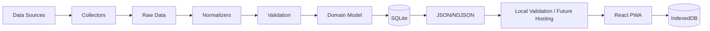

# Architecture

## Components

Collector 負責 Request、Pagination、Source Parsing、Raw Object；Normalizer 負責清理、Mapping、單位轉換與 Domain Model。Collector 不得直接寫 Listing DB。Validation 後寫 SQLite，輸出 `public/data/metadata.json`、區域 listings JSON、history NDJSON、transactions JSON；SQLite 不直接供 Pages 使用，也不每次 Crawl commit。

前端採 React、Vite、TypeScript、PWA、IndexedDB；GitHub Pages 優先 HashRouter。SQLite 用於 processing、normalization、history、analysis、development；IndexedDB 僅存個人狀態。

GitHub Actions 的 CI、Data Refresh 與 Pages workflow 目前全部停用；未來若重新啟用，必須先恢復受控的 Node.js 22 runtime、權限與資料發布驗證。來源獨立執行／allSettled，錯誤互不影響。Phase 1 不需 Backend、VPS、Cloud SQL、AWS、Azure；不得繞過 CAPTCHA、登入、Access Control 或封鎖。

短期驗證路徑為 Local Build → Local Preview → Offline Browser Validation → Fixture Data Validation → Repository CI；暫不納入 GitHub Pages Deployment、Production URL Validation 或 PWA Production Validation。Crawler、Refresh、Publication 與 Web Hosting 解耦，Pages 暫停不影響 SQLite canonical state、Candidate lifecycle、MOI pipeline、591 fail-closed boundary 或 JSON/NDJSON publication。

## Production Scope v1

正式 crawler boundary 為臺北市與新北市全部行政區，來源包含 `591-sale`、`591-newhouse` 與 MOI。MOI 使用 rolling 5 years 的正式交易日期語意。Bootstrap 與正常 Refresh 共用 `crawler/scope/production.ts` 的 Production Scope Source of Truth；各 source adapter 僅保留自己的 city identifier mapping。Decision Engine、AI Advisor、GitHub Pages 與 GitHub Actions 維持 Deferred / NOT IN SCOPE。
