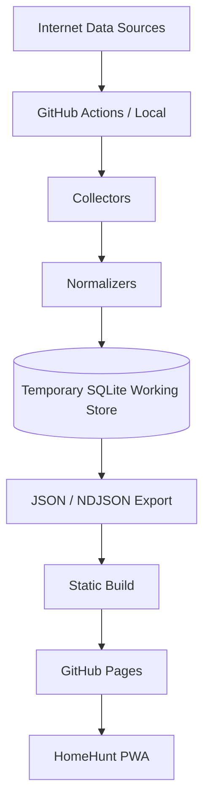

# Deployment / CI-CD / Data Publication

## Deployment Architecture



Phase 1 Hosting 為 GitHub Pages，Frontend 為 React/Vite/TypeScript/PWA。Pages 只提供靜態 Frontend、Published JSON/NDJSON 與 PWA assets，不執行 Crawler、SQLite runtime、Server API 或 Background Job。Crawler 主要在 GitHub Actions 執行，Local 是 fallback；不建立 Backend、VPS、Cloud SQL、AWS/Azure Backend 或 SSR。Production 只有 GitHub Pages，Local 用於 Development/Debug。

## Workflow Separation

未來至少分為：

- `.github/workflows/ci.yml`：push、pull_request；執行 `npm ci`、`npm run typecheck`、`npm run lint`、`npm run test`、`npm run build`，涉及 E2E 時再執行 `npm run test:e2e`。
- `.github/workflows/data-refresh.yml`：schedule、workflow_dispatch；執行 Collectors、Normalization、Data Export。
- `.github/workflows/pages.yml`：建置並部署 PWA。

Application CI 與 Data Refresh 必須分離。外部來源 403 或暫時失效不得使普通 Frontend CI 失敗；Build/test 未實際成功不得部署新版。Data Refresh 自動 commit 時須避免觸發自身無限遞迴，並以 concurrency 防止兩個 refresh 同時修改 canonical data。Actions 採最小權限：一般 CI `contents: read`；只有需要 commit 的 Data Refresh 才授予 `contents: write`；Pages 僅取得必要部署權限。

## Refresh Schedule and Failure Handling

房源產品排程語意為每日 08:20、20:20 Asia/Taipei 增量更新，每週一次 reconciliation；實作 Cron 時轉換為 UTC。MOI 可每日檢查 upstream version/checksum，無變化為 `SKIPPED`；有新版才執行 Download → Parse → Normalize → Upsert → Export。Workflow 與每個 Source 都必須有 timeout，具體分鐘數留實作階段決定。

只有 Source `SUCCESS` 才能增加 missing_success_count、推進 MISSING/DELISTED。PARTIAL/FAILED 不得 destructive reconciliation。單一來源失敗時保留該來源上一個 successful dataset，metadata 記錄目前 status、lastSuccessfulRunAt、lastAttemptAt；其他成功來源照常發布。Partial 結果不得取代完整 canonical dataset，可保存不公開的 debug artifact。

## SQLite and Canonical Data

SQLite 是 temporary / working / processing store，用於 ingestion、normalization、history comparison、listing lifecycle、transaction processing 與 export；不是 GitHub Pages runtime database，也不直接作為公開格式。Runner 磁碟不具長期持續性，因此每次流程：

```text
Checkout → Load previous exported state → Hydrate SQLite
→ Collect → Lifecycle update → Export canonical state
```

Canonical exported state 以 Git 追蹤的文字資料保存必要歷史。Published data 可位於 `public/data/` 或獨立 data source 後再 copy；Source of Truth 必須與 `dist/` build artifact 區分。`dist/` 不作唯一歷史來源，`node_modules/` 不提交。

## Published Data

公開格式為 JSON/NDJSON，職責分離：

```text
public/data/
├─ metadata.json
├─ listings/       # current listing state
├─ history/        # price and lifecycle history
└─ transactions/  # public transaction data
```

`metadata.json` 至少包含 `schemaVersion`、`appDataVersion`、`generatedAt`，以及每個 Source 的 `sourceId`、`status`、`lastSuccessfulRunAt`、`lastAttemptAt`、`itemCount`。Breaking schema change 必須增加 schemaVersion；Frontend 遇到不支援的版本要顯示資料版本不相容，不得靜默解析。

公開資料只包含公開房源、公開成交、來源狀態、更新時間、價格歷史與生命週期必要資料。收藏、永久排除、已看屋、notes、rating 等 UserState 僅存 IndexedDB。RawSnapshot 屬 working/debug data，不得預設發布；Public repository 必須視為任何人可讀，不得含私人資訊、Cookie、Token、API Key、Session 或 Password。未來 Secrets 只能放 GitHub Secrets，且不得進入 source、fixture、log 或 published data。

## Atomic Publication and Validation

發布採 staged/atomic 概念：

```text
Generate staging output → Validate entire dataset → Publish together
```

至少驗證 JSON/NDJSON 可解析、schema valid、metadata 必要欄位存在、Listing ID 唯一、價格非負、無 NaN/Infinity、Source references 有效，且 Published Data 不含 UserState。另需有可配置的 anomaly guard；若來源 item count 相較上一個 SUCCESS snapshot 異常劇烈下降，標記 suspicious 並阻擋自動發布。任何 validation/anomaly failure 都保留上一版資料。

若資料成功且確實改變，才建立例如 `data: refresh housing listings` 的 commit；無變更不建立空 commit，且只提交本次 data changes，不帶入無關程式修改。

## PWA Cache Strategy

區分 Application Shell、Published Data、External Source：

- App Shell（HTML、JS、CSS、icons）適合 precache。
- Published JSON/NDJSON 採可控 stale strategy，建議 Network First + cached fallback；有網路優先取得新資料，離線使用上一份成功資料。
- 不直接依賴永久舊 cache；以 `appDataVersion` 偵測更新並重新取得資料。

離線仍可搜尋 cached listings、篩選、排序、收藏、永久排除、已看屋，並顯示「離線模式」、目前資料版本與最後成功更新時間。Application Shell 有新版時提示「有新版本可用」，由使用者選擇重新整理。GitHub Pages repository site 必須支援可配置 Vite base path（例如 `/HomeHunt/`），Routing 優先 HashRouter。

## Rollback and Notification

Application rollback 使用上一個 known-good Git commit；Data rollback 與 Application rollback 分開，資料錯誤時 revert bad data commit 恢復 previous known-good dataset。Phase 1 最低通知要求是 GitHub Actions workflow failure 可見，metadata 反映 Source 狀態；Email、Slack、Discord 等留未來評估。

## Deployment Acceptance Criteria

- **DEP01–DEP03**：Pages 僅提供 static frontend/data；Crawler 不在 Pages runtime；CI、Data Refresh、Pages workflow 分離。
- **DEP04–DEP08**：來源失敗保留 successful data；PARTIAL/FAILED 不 reconciliation；整批 validation 後 atomic publish；UserState 不進 public data。
- **DEP09–DEP12**：Published Data 有 schemaVersion、appDataVersion、generatedAt；PWA 可使用上一版 offline cache 並偵測新版。
- **DEP13–DEP16**：無資料變更不空 commit；Actions least privilege；Application/Data 可由 Git rollback；正確處理 repository base path。
- **DEP17–DEP20**：Concurrency 防止並行 refresh；anomaly guard 阻擋異常資料；單一 Source FAILED 不影響其他來源；未實際通過 build/test 不得部署。

本文件只定義規格；尚未建立 workflow、啟用 Pages、下載 MOI、抓取 591、建立 dataset、Service Worker 或 deployment script。
