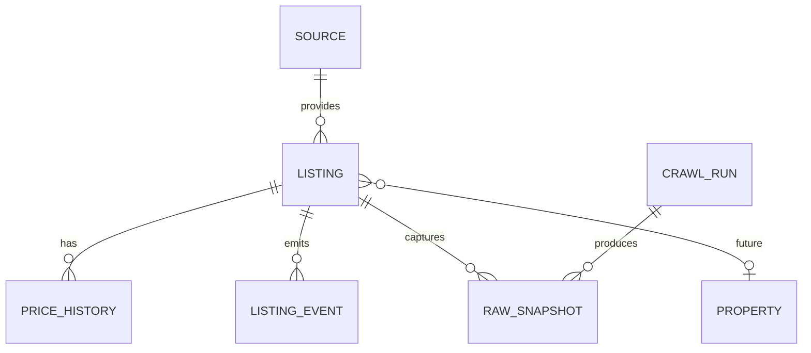

# Domain Model

## Entities

- **Source**：來源與最後成功狀態。
- **Listing**：來源出售房源，ID 為 `{sourceId}:{sourceListingId}`，不使用 URL；預留 nullable `propertyId`，Phase 1 不去重。
- **PriceHistory**：`listingId`、`totalPrice`、`unitPrice`、`parkingPrice`、`observedAt`，只在價格改變時新增。
- **ListingEvent**：`LISTING_DISCOVERED`、`PRICE_DECREASED`、`PRICE_INCREASED`、`MARKED_MISSING`、`RESTORED`、`DELISTED`、`RELISTED`、`CONTENT_CHANGED`，含 old/new value、metadata、occurredAt。
- **Transaction**：MOI 實際成交，與 Listing 開價分離；Phase 1 支援 USED/PRESALE。
- **UserState**：收藏、永久排除、已看屋及預留 notes/rating/contacted/visitDate/tags，僅 IndexedDB。
- **CrawlRun**：SUCCESS、PARTIAL、FAILED 與統計。
- **RawSnapshot**：新 Listing 或 `rawDataHash` 改變才保存，每 Listing 最近 5 份。

## Enums / Null / Units

狀態為 ACTIVE、MISSING、DELISTED；RELISTED 是事件。建物型態：RESIDENTIAL_HIGHRISE、MIDRISE、APARTMENT、TOWNHOUSE、STUDIO、VILLA、OTHER、UNKNOWN。車位：RAMP_FLAT、RAMP_MECHANICAL、LIFT_FLAT、LIFT_MECHANICAL、PLANE、OTHER、UNKNOWN。缺資料為 null/undefined，不推成 0 或 false。金額 NTD 元、單價 NTD/坪、面積坪；`坪 = m² × 0.3025`。室內坪數優先 indoorArea，或僅在 mainArea 與 auxiliaryArea 都有時相加。

## Lifecycle / Idempotency

```text
首次 → ACTIVE + LISTING_DISCOVERED
ACTIVE + 一次 SUCCESS 未找到 → MISSING
MISSING + 找到 → ACTIVE + RESTORED
MISSING + 連續 3 次 SUCCESS 未找到 → DELISTED + event
DELISTED + 找到 → ACTIVE + RELISTED，relistCount + 1
```

PARTIAL/FAILED 不推進 missing count；價格不變不新增歷史。`contentHash` 只 hash canonical 業務欄位，`rawDataHash` hash raw payload。


