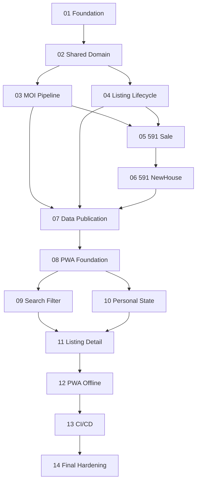

# HomeHunt Implementation Roadmap

本目錄是正式 Coding 前的唯一實作順序基準。每次只執行一個 Phase；完成後驗證、回報並停止，不自動進入下一 Phase。

## Dependency Roadmap

| Phase | 名稱              | 前置       | 可部分平行   | 停止條件                                      |
| ----- | ----------------- | ---------- | ------------ | --------------------------------------------- |
| 01    | Foundation        | 無         | 否           | skeleton 可 build/test/typecheck/lint         |
| 02    | Shared Domain     | 01         | 否           | schema、utilities、unit tests 完成            |
| 03    | MOI Pipeline      | 02         | 可與 04 平行 | fixture pipeline 至 SQLite 通過               |
| 04    | Listing Lifecycle | 02         | 可與 03 平行 | lifecycle 與 history tests 通過               |
| 05    | 591 Sale          | 03、04     | 否           | search crawl fixture 與 isolation 通過        |
| 06    | 591 NewHouse      | 05         | 否           | range/type mapping 通過                       |
| 07    | Data Publication  | 03、04、06 | 否           | atomic validation/export 通過                 |
| 08    | PWA Foundation    | 07         | 否           | shell、loader、狀態畫面通過                   |
| 09    | Search Filter     | 08         | 可與 10 平行 | filter/sort acceptance 通過                   |
| 10    | Personal State    | 08         | 可與 09 平行 | IndexedDB persistence 通過                    |
| 11    | Listing Detail    | 09、10     | 否           | detail/history/actions 通過                   |
| 12    | PWA Offline       | 11         | 否           | offline cache/E2E 通過                        |
| 13    | CI/CD             | 12         | 否           | workflows、permissions、refresh controls 通過 |
| 14    | Final Hardening   | 13         | 否           | full quality gate 與 rollback checks 通過     |

## Scope Rules

Phase 1 不做跨網站 Property 去重、AI、估價模型、多人帳號、登入、跨裝置同步、Backend/API、Cloud Database、通知服務。SQLite driver、CSS solution、icon library 在需要前選擇最小相容方案，不在文件階段強制指定。

## Open Questions / Deferred Decisions

- GitHub Pages 暫短期停用；Production Hosting、Production URL 與正式 PWA validation deferred。近期優先完成 591 adapters、crawler／refresh orchestration、fixture publication validation、offline browser smoke test 與 known-good protection，再評估 hosting 方案。

- Phase 03 開始前決定 Node.js 22 相容且最小的 SQLite driver。
- Phase 08 開始 UI 實作前決定 CSS/UI solution。

兩者皆不阻擋 Phase 01。

## Codex Execution Rule

後續指令應明確指定單一文件，例如：「依 `phase-03-moi-pipeline.md` 完成 Phase 03」。Codex 必須閱讀 AGENTS.md 與相關 docs，只修改該 Phase 範圍，完成適用驗證後停止。

## Phase Completion Report

每 Phase 回報：完成內容、檔案、重要決策、實際驗證與結果、warning/limitation、git status、未提交變更、是否符合 DoD、下一 Phase。不得宣稱未執行的命令成功。
